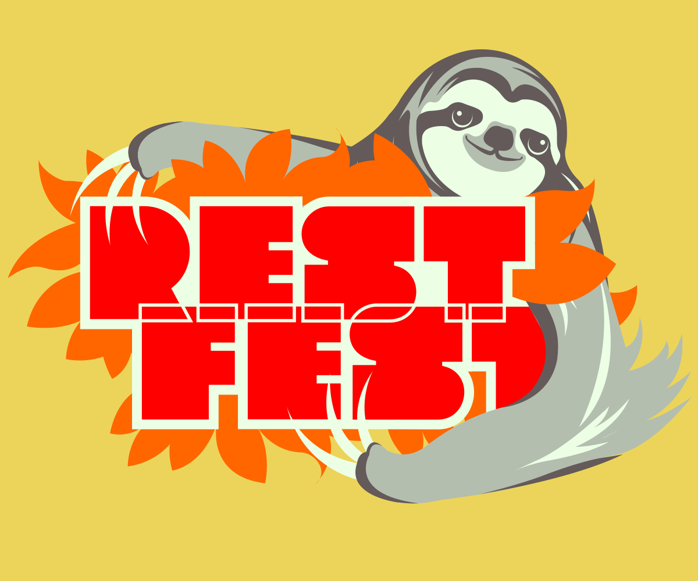
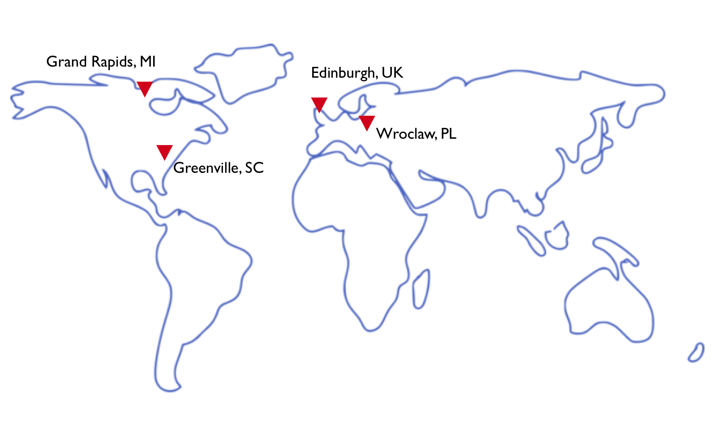
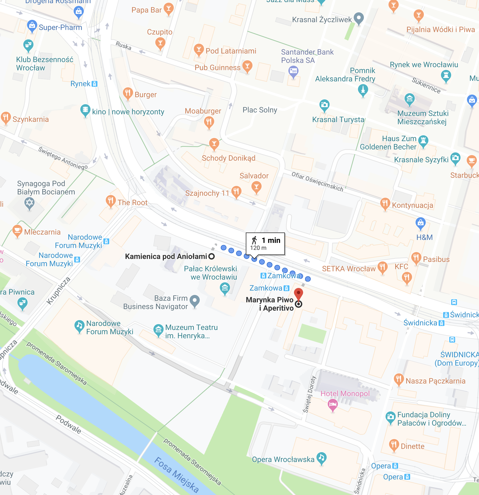

autoscale: true

---

# How it started

* Almost 10 years ago...
* REST and web community wasn't as friendly of a place
* Benjamin & Mike created RESTFest, an unconference focused on building community and collaboration
* Now, REST Fest has happened in 3 locations beyond South Carolina, including Wrocław now!

---

---

# How it works

> Everybody talks, everybody listens
-- Benjamin Young

  

* Two talk types: feature talks, 5-in-5
* Hands-on experience
* Panel discussions

---

## Agenda

### Friday

#### Workshop; hack day; keynote

* 9 AM-12:30 PM - Hypermedia Workshop with Todd Brackley
* 12:30 PM - Lunch (ground floor)
* 1:30 PM-4:30 PM - Hacking and demos
* 6 PM-7PM - Keynote by Fran Mendez
* 7 PM - :tada: Departure for party :tada:

---

## Agenda

### Saturday

#### Talk day

* 8:30 - Breakfast
* 9:30-10:30 - Session 1
* 10:45-12 - Session 2
* 12-13 - Lunch
* 13-14:15 - Session 3
* 14:30-15:30 - Session 4
* 15:45-17:00 - Session 5
* 17:30 - More party at Marynka

---

## Questions?